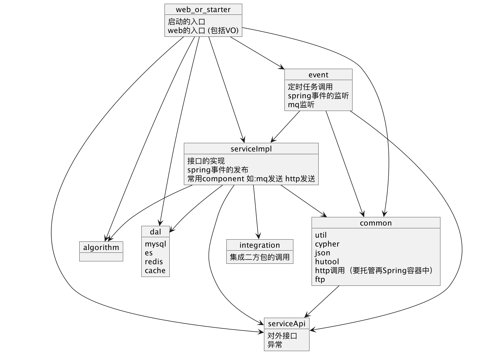

# 此项目用于学习，java代码练习场

[English document](https://github.com/deipss/java-edu/blob/master/README-en.md)


- java-edu-algorithm 学习常用算法数据结构，包括图、树、双指针等
- java-edu-base java语法基础，包括并发包、注解、日期
- java-edu-pattern 常见设计模式
- java-edu-spring spring开源及常用中间件
  - mysql
  - redis
  - rocketmq
  - dubbo 
  - zookeeper
- java-edu-sql 关系型sql
- java-edu-web web相关

# 结构


# script
```shell
nohup java -jar java-edu-web-1.0.1-SNAPSHOT.jar  Xms1G Xmx1G\
-XX:+PrintGCDetails \
-XX:+PrintGCDateStamps \ 
-XX:+PrintTenuringDistribution \ 
-XX:+PrintHeapAtGC  \
-XX:+PrintReferenceGC \ 
-XX:+PrintGCApplicationStoppedTime \
-XX:+PrintSafepointStatistics \
-XX:PrintSafepointStatisticsCount=1 \
-Xloggc:/path/to/gc-%t-log \
-XX:+UseGCLogFileRotation \
-XX:NumberOfGCLogFiles=14 \
-XX:GCLogFileSize=100M \
> java-edu-web.log 2>&1 &
```